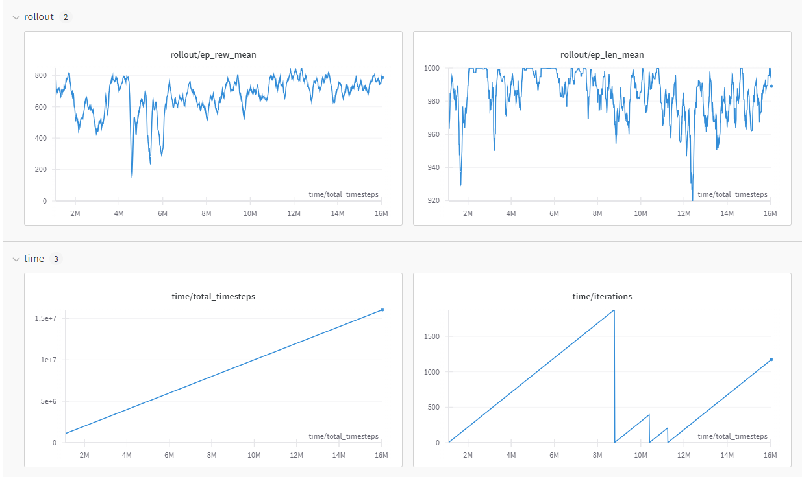

# Car Racing PPO (Proximal Policy Optimization)
Horribly optimized AI learns to play 2d car racing game.

# How to Install
1. Download finished_result.py and train.py
2. Add account or remove the wandb addon in train.py
3. run train.py

# Errors
Few errors can occur trying to use stable_baselines3
1. Download [Swig](https://www.swig.org/download.html)
2. Import the download into your system environment variables.
If any python packages aren't installed, use pip install.

# Wandb Stats
Trained 16 million timesteps.

